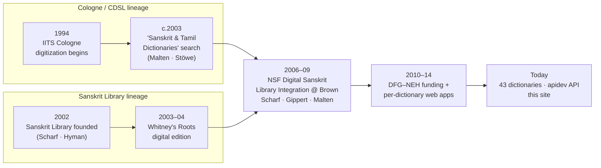

import SiteVersion from '@site/src/components/SiteVersion';

# Origins

The site you are reading is the visible tip of a thirty-year effort that grew from **two
roots that eventually merged**:

- a **Cologne** lineage — the digitization and markup of the great 19th-century Sanskrit
  dictionaries at the *Institut für Indologie und Tamilistik* (IITS), University of Cologne,
  driven by **Thomas Malten** and colleagues; and
- a **Sanskrit Library** lineage — Peter Scharf and Malcolm Hyman's work in the United States
  on integrated, computable Sanskrit text and lexical resources.

These were never wholly separate — Cologne supplied the dictionary data the Sanskrit Library
integrated, and the same people (Malten, Scharf, Jim Funderburk) recur across both — but they
began as distinct projects with their own funding and goals. The single timeline below braids
them together up to the present site.

This page is the long-form origin story. For the project's own dated version log of *recent*
releases, see the [History](history) timeline; for the publications it rests on, see
[Publications & Bibliography](publications).

## Two pages that bracket the early web era

The two oldest surfaces of this history are still reachable:

- **The Cologne anchor — the "Sanskrit and Tamil Dictionaries" search.** The page at
  [`sanskrit-lexicon.uni-koeln.de/scans/MWScan/tamil/`](https://www.sanskrit-lexicon.uni-koeln.de/scans/MWScan/tamil/index.html)
  is a first-generation Cologne web display: a single interface searching across
  Monier-Williams, Capeller's Sanskrit–English, the Cologne Online **Tamil** Lexicon, and a
  Concise Pahlavi dictionary (~321,620 entries). It was built **c. 2003** by **Thomas Malten**
  (who supplied the digitized dictionaries) and **Kira Stöwe** (who programmed the display).
  It is now preserved and maintained as the GitHub repo
  [`sanskrit-lexicon/Cologne-Sanskrit-Tamil`](https://github.com/sanskrit-lexicon/Cologne-Sanskrit-Tamil)
  — explicitly "a web-frontend port of the Cologne MWScan 'tamil' multi-dictionary search."
- **The Sanskrit Library anchor — the development history.** The page at
  [`sanskritlibrary.org/development2.html`](https://sanskritlibrary.org/development2.html)
  records the Sanskrit Library's own 2001–2013 development, from Whitney's *Roots* through the
  NSF integration project that formally tied it to Cologne.

## A single merged timeline

| When | Cologne / CDSL | Sanskrit Library / computational track |
|---|---|---|
| **1994** | The Sanskrit lexicons begin to be prepared at the **IITS, University of Cologne** — the start of the Cologne Digital Sanskrit Lexicon (CDSL). | |
| **1997** | **Kapp & Malten**, *Report on the Cologne Sanskrit Dictionary Project*, describes the plan to digitize and merge the major 19th-century bilingual Sanskrit dictionaries without altering their structure. | |
| **2001–02** | | The **Sanskrit Library** is founded as a Rhode Island non-profit (**4 November 2002**); Peter Scharf and Malcolm Hyman begin building computable Sanskrit resources. |
| **2003** | The **"Sanskrit and Tamil Dictionaries"** web search ([MWScan/tamil](https://www.sanskrit-lexicon.uni-koeln.de/scans/MWScan/tamil/index.html)) goes online — Malten (data) + Kira Stöwe (display). | Scharf & Hyman produce a digital edition of **Whitney's** *The Roots, Verb-Forms and Primary Derivatives of the Sanskrit Language* and inflection software (a \$4,607 Consortium for Language Teaching and Learning grant, 2003–04). |
| **2006–2009** | Cologne (Malten) is a core data partner. | The NSF-funded **International Digital Sanskrit Library Integration** project runs at Brown University (\$247,350), led by Scharf with **Jost Gippert** (TITUS, Frankfurt) and **Thomas Malten** (CDSL, Cologne) — the formal convergence of the two lineages. |
| **2007–2013** | | The **International Sanskrit Computational Linguistics Symposia** series begins (1st: INRIA, Oct 2007, Gérard Huet; 2nd: May 2008; 3rd: Hyderabad, Jan 2009; 4th: JNU, Dec 2010; 5th: IIT Bombay, Jan 2013). |
| **May 2008** | **Funderburk & Malten**, *"Marking Monier"* — presented at the 2nd Symposium — walks through the four phases of digitizing and marking up the Monier-Williams dictionary. | The same symposium that hosts "Marking Monier." |
| **2009** | | The Sanskrit Library's Vedic work helps extend the **Unicode Standard** (68 characters, Unicode 5.2). |
| **2010** | | **Peter Freund** (Vedic Reserve) joins, contributing a large digital-text archive; the library reports ~300 digital texts, 131 online. |
| **2010–2013** | The **DFG–NEH Project** funds the digitization of many works — the dictionaries still marked with an asterisk (\*) on the CDSL front page. | |
| **2013–2014** | The current per-dictionary **web display applications** are generated (the "scan year" recorded for most dictionaries). | |
| **~2015** | **Jim Funderburk** implements the present `apidev` API in PHP, the engine behind today's live lookups. | |
| **Sep 2021** | The [**csl-newsletter**](https://github.com/sanskrit-lexicon/csl-newsletter) daywise log begins; [`csl-devanagari`](https://github.com/sanskrit-lexicon/csl-devanagari) is created for output closer to the printed text; the front page lists **38** dictionaries. | |
| **Dec 2023** | *Abhidhānacintāmaṇi* of Hemacandra (`ABCH`) is added; **CDSL version 2.5.0**. | |
| **Now** | Version **<SiteVersion />**; **42** fully digitized dictionaries (plus the `PD` sample), source in the `v02` layout of [`csl-orig`](https://github.com/sanskrit-lexicon/csl-orig); see the [catalog](../dictionaries/catalog). | The Sanskrit Library continues its [presentation of the Cologne dictionaries](https://sanskritlibrary.org/cologne.html). |

## Where the two roots meet today

This documentation site, the live per-dictionary displays, the `apidev` API, and the
side-by-side [multi-dictionary comparison](../tools/multi-dictionary) all sit on the Cologne
data lineage; the Sanskrit Library lineage contributed the integration model, the
computational-linguistics community (the Symposia), and people — Scharf, Funderburk, Malten —
who worked across both. The [Sanskrit Library's Cologne page](https://sanskritlibrary.org/cologne.html)
remains a parallel presentation of the same underlying dictionaries.

:::note Dating and verification
The two earliest entries are dated from the project's own standing statements rather than a
single archival record: **1994** is the CDSL front page's own "prepared since 1994"; the
**1997** *Report* and the **c. 2003** date of the "Sanskrit and Tamil Dictionaries" search are
approximate to the year. The Sanskrit Library dates and figures are quoted from
[`development2.html`](https://sanskritlibrary.org/development2.html) and
[`about.html`](https://sanskritlibrary.org/about.html). If you can supply a firmer source for
any early date, please [open an issue or PR](https://github.com/sanskrit-lexicon/csl-guides).
:::
