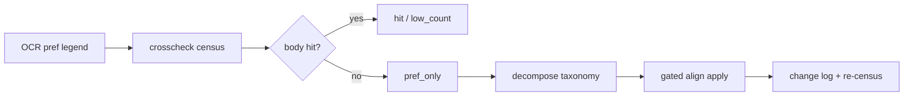

# Pref × body residual methods — typed `pref_only` appendix

_Created: 24-07-2026 · Last updated: 24-07-2026_

**Use case:** [UC-13](https://github.com/sanskrit-lexicon/csl-guides/blob/main/docs/dictionaries/preface-front-matter-enrichment-use-cases.md) · **Tracking:** [csl-guides#123](https://github.com/sanskrit-lexicon/csl-guides/issues/123) · **Handoff:** [H1594](https://github.com/gasyoun/Uprava/blob/main/handoffs/H1594-Sonnet_csl-guides_pref-residual-methods-appendix_24.07.26.md) · **Policy:** [pref-body-naming-authority](https://github.com/sanskrit-lexicon/csl-guides/blob/main/docs/dictionaries/pref-body-naming-authority.md)

This page is the **site methods appendix** for residual analytics over OCR preface abbreviation legends joined to digitized dictionary bodies. It packages committed census and classify artifacts so a data paper, FINDINGS entry, or peer review can cite **typed residual**, not a raw “unused key” count.

## One-line claim

**`pref_only` is a typed residual class, not a list of unused abbreviations.** After case- and diacritic-fold matching, keys that still miss the body fall into `ortho` · `rare` · `ocr_key` · `spacing` · `true_unused` · `ambiguous` — most high-volume PWG/PW residue was orthography or OCR, not “works the editor listed and never cited.”

## What is measured

| Term | Definition |
|------|------------|
| **Pref key** | Siglum / abbreviation string from an OCR pref legend (Markdown front matter). |
| **Body hit** | At least one non-short occurrence of that key (after fold) in `csl-orig/v02/{dict}/{dict}.txt`. |
| **`pref_only`** | Pref key with body count 0 under the current fold rules (frozen in crosscheck TSV). |
| **Typed residual** | `pref_only` row after [`pref_only_decompose.py`](https://github.com/sanskrit-lexicon/csl-guides/blob/main/scripts/pref_only_decompose.py) classification. |
| **Apply** | Gated key rewrite toward a **body-attested** alt form ([naming authority](https://github.com/sanskrit-lexicon/csl-guides/blob/main/docs/dictionaries/pref-body-naming-authority.md)). |

Pref **expansions** (full titles) stay scan-faithful. Only **siglum naming** is aligned when body wins.

## Pipeline (waves)

| Wave | Deliverable | Role |
|------|-------------|------|
| H1530 / H1543 | [`pref_abbr_crosscheck.py`](https://github.com/sanskrit-lexicon/csl-guides/blob/main/scripts/pref_abbr_crosscheck.py) | Parse legends; count keys in body; case + diacritic fold; rollup [`ALL_pref_abbr_crosscheck.md`](https://github.com/sanskrit-lexicon/csl-guides/blob/main/scripts/out/ALL_pref_abbr_crosscheck.md) |
| H1560 | [`pref_only_decompose.py`](https://github.com/sanskrit-lexicon/csl-guides/blob/main/scripts/pref_only_decompose.py) | Type residual; pilot PWG+PW [`PWG_PW_pref_only_decompose.md`](https://github.com/sanskrit-lexicon/csl-guides/blob/main/scripts/out/PWG_PW_pref_only_decompose.md) |
| H1569 | Policy + [`pref_key_body_align.py`](https://github.com/sanskrit-lexicon/csl-guides/blob/main/scripts/pref_key_body_align.py) | Body wins for naming; change logs under `scripts/out/*_pref_key_body_align_changes.*` |
| H1571 | Catalog-wide decompose + apply | Full-catalog residual rollup [`ALL_pref_only_decompose.md`](https://github.com/sanskrit-lexicon/csl-guides/blob/main/scripts/out/ALL_pref_only_decompose.md); MW72 list-bullet false positives skipped |
| H1580 | Rewrite boost | Live body re-probe; dual-side ortho; list-safe replace — **PWG `pref_only` 68→55, PW 37→26** (summary JSON freeze) |
| H1591 | Legend store (UC-3) | Residual class joined into machine-readable legend JSON |
| H1592 | Fold table (UC-8) | Versioned [`pref_fold_table.json`](https://github.com/sanskrit-lexicon/csl-guides/blob/main/scripts/pref_fold_table.json) — no invent-a-fold |



## Residual taxonomy

Classifier meanings (from the tool’s report template):

| Class | Meaning | Default disposition |
|-------|---------|---------------------|
| `ortho` | Pref orthography ≠ body (fold incomplete; e.g. German *j*/*y*, `Ç`/`Ś`, `Gṛhj`/`Gṛhy`) | Apply when `alt_body_count ≥ 1` |
| `rare` | Starred / MS / occasional work; body 0 is plausible | **Hold** |
| `ocr_key` | Pref key OCR error vs print/body form | Apply when body-attested alt exists |
| `spacing` | Multi-token spacing / punctuation / dual-key mismatch | Apply when body-attested alt exists |
| `true_unused` | Legend key not used in digitized body (often long bibliography / external works) | **Hold** (not invent) |
| `ambiguous` | Needs human / scan check | **Hold** + provisional `work_id` + `review_required` when identity is forced (R8) |

## Headline tables (committed freezes)

All numbers below are **reproducible from committed** `scripts/out/*` artifacts (date-stamped in those files). Re-running tools against a newer `csl-orig` body can shift counts; cite the artifact path and date when publishing.

### A. Pilot finding (H1560) — residual is typed

H1543 left high `pref_only` on PWG (133) and PW (89) **even with case + diacritic fold**. Sample-frame class shares (top-50 by key length):

| Dict | pref_only total | sample | ortho | rare | ocr_key | spacing | true_unused | ambiguous |
|------|----------------:|-------:|------:|-----:|--------:|--------:|------------:|----------:|
| **PWG** | 133 | 50 | 13 | 5 | 2 | 19 | 11 | 0 |
| **PW** | 89 | 50 | 31 | 1 | 7 | 0 | 9 | 2 |

Source: [`scripts/out/PWG_PW_pref_only_decompose.md`](https://github.com/sanskrit-lexicon/csl-guides/blob/main/scripts/out/PWG_PW_pref_only_decompose.md).

**Reading:** a large share of the pilot sample is `ortho` or `spacing`, not `true_unused`. “Unused” is a minority class in that frame.

### B. Catalog residual rollup (H1571 full decompose)

Full-catalog `--sample-n 0` class counts (one freeze; includes pre–rewrite-boost rows for some dicts):

| Dict | pref_only total | ortho | rare | ocr_key | spacing | true_unused | ambiguous |
|------|----------------:|------:|-----:|--------:|--------:|------------:|----------:|
| **AP90** | 7 | 0 | 0 | 0 | 0 | 7 | 0 |
| **BEN** | 17 | 7 | 0 | 0 | 0 | 10 | 0 |
| **BHS** | 53 | 0 | 0 | 0 | 14 | 39 | 0 |
| **BOR** | 74 | 0 | 0 | 13 | 0 | 57 | 4 |
| **CAE** | 1 | 0 | 0 | 0 | 0 | 1 | 0 |
| **GRA** | 6 | 0 | 0 | 0 | 0 | 6 | 0 |
| **IEG** | 6 | 0 | 2 | 0 | 0 | 4 | 0 |
| **INM** | 5 | 0 | 0 | 0 | 0 | 5 | 0 |
| **MD** | 20 | 0 | 0 | 0 | 0 | 20 | 0 |
| **MW72** | 153 | 1 | 0 | 0 | 106 | 46 | 0 |
| **PGN** | 2 | 1 | 0 | 0 | 0 | 1 | 0 |
| **PW** | 64 | 33 | 1 | 12 | 0 | 16 | 2 |
| **PWG** | 112 | 48 | 14 | 16 | 8 | 23 | 3 |
| **SCH** | 1 | 1 | 0 | 0 | 0 | 0 | 0 |
| **SHS** | 14 | 0 | 0 | 0 | 0 | 14 | 0 |
| **SNP** | 4 | 0 | 1 | 0 | 0 | 3 | 0 |

Source: [`scripts/out/ALL_pref_only_decompose.md`](https://github.com/sanskrit-lexicon/csl-guides/blob/main/scripts/out/ALL_pref_only_decompose.md).

**Reading:** MW72’s large `pref_only` is dominated by **`spacing`** (grammar/list metalanguage and multi-token keys), not work-siglum unused stock. Grammar-heavy dicts (MD, SHS, CAE) are almost entirely `true_unused` under a **work-citation** body probe — that is a second metalanguage channel, not failed OCR (see UC-5 / residual note in the [enrichment proposal](https://github.com/sanskrit-lexicon/csl-guides/blob/main/docs/dictionaries/preface-front-matter-enrichment-use-cases.md)).

### C. Align apply census (H1571 + H1580)

| Dict | status (H1580 freeze) | pref_only (post-boost census) | change rows | replacements |
|------|------------------------|------------------------------:|------------:|-------------:|
| **PWG** | ok | **55** | 15 | 48 |
| **PW** | ok | **26** | 11 | 33 |
| **BEN / BHS** | ok (wave apply earlier) | (see per-dict TSVs) | — | — |
| **MW72** | **skipped** | 153 | 0 | 0 |
| Other residual dicts | ok | mostly true_unused | 0 | 0 |

- Align rollup: [`scripts/out/ALL_pref_key_body_align.md`](https://github.com/sanskrit-lexicon/csl-guides/blob/main/scripts/out/ALL_pref_key_body_align.md) (26 change rows · 81 replacements total; MW72 skipped).
- Live census freeze: [`pwg_pref_abbr_crosscheck.summary.json`](https://github.com/sanskrit-lexicon/csl-guides/blob/main/scripts/out/pwg_pref_abbr_crosscheck.summary.json) (`pref_only`: 55 of 395 keys) · [`pw_pref_abbr_crosscheck.summary.json`](https://github.com/sanskrit-lexicon/csl-guides/blob/main/scripts/out/pw_pref_abbr_crosscheck.summary.json) (`pref_only`: 26 of 302 keys).
- Changelog trail: H1580 records **PWG 68→55**, **PW 37→26** on the rewrite-boost pass alone.

### D. Hit-rate style summary (pilot dicts, post-boost)

| Dict | keys (legend) | body hits (non-short) | pref_only | hit rate (non-short / keys) |
|------|--------------:|----------------------:|----------:|----------------------------:|
| **PWG** | 395 | 335 | 55 | 84.8 % |
| **PW** | 302 | 272 | 26 | 90.1 % |

Hit rate here is **not** “share of declared library used in print” — short keys are bucketed separately, and expansions never enter the denominator. It is the share of **parsed legend keys that match body under fold**. Prefer reporting `pref_only` **by residual class** when making a scholarly claim.

## Limitations (must travel with any quote)

1. **Freeze vs live body.** Counts are frozen in `scripts/out/` on 24-07-2026 tooling runs. A newer `csl-orig` or re-OCR of pref pages changes denominators; re-run and re-cite.
2. **Fold incompleteness.** Residual `ortho`/`ocr_key` means the fold table is incomplete, not that the work is unused. New folds go in [`pref_fold_table.json`](https://github.com/sanskrit-lexicon/csl-guides/blob/main/scripts/pref_fold_table.json) with body attestation — never silent invent-a-fold.
3. **Grammar metalanguage.** Keys that are case/morph labels (`abl.`, `s.v.`, class marks) are often `true_unused` against a citation-oriented body probe; that measures the **wrong channel**, not dictionary failure.
4. **MW72 skipped for bulk apply.** List-bullet false positives caused H1571/H1580 to skip MW72 apply; residual remains high and **must not** be reported as mass unused bibliography without reclassification.
5. **Sample frames.** Early H1560 tables are top-N samples; H1571 full-catalog counts are the better denominators for papers. Do not mix sample *n* with catalog *n* in one percentage.
6. **No second lexicon.** Pref is not a second body; full-diff Vorwort vs body is out of scope ([non-goals](https://github.com/sanskrit-lexicon/csl-guides/blob/main/docs/dictionaries/preface-front-matter-enrichment-use-cases.md)).
7. **Rights / publish safety.** Front-matter packaging for FAIR editions is UC-11; residual tables themselves are derived measurements over already-public OCR + body paths.

## How to cite (paper / FINDINGS)

Suggested methods sentence:

> Pref-legend keys were censused against csl-orig body text with case- and diacritic-fold matching ([`pref_abbr_crosscheck.py`](https://github.com/sanskrit-lexicon/csl-guides/blob/main/scripts/pref_abbr_crosscheck.py)). Keys with zero body hits (`pref_only`) were classified into a six-way residual taxonomy ([`pref_only_decompose.py`](https://github.com/sanskrit-lexicon/csl-guides/blob/main/scripts/pref_only_decompose.py)); body-attested orthography/OCR variants were rewritten under a documented naming authority, with per-key change logs. Residual tables and freezes: `scripts/out/` in [sanskrit-lexicon/csl-guides](https://github.com/sanskrit-lexicon/csl-guides); site appendix: this page.

For Uprava FINDINGS or ARTICLES methods: link this page + the concrete TSV/MD path + the handoff ID that produced the freeze (H1560 / H1571 / H1580).

## Reproduce

```text
# Census one dict (needs sibling csl-orig body)
python scripts/pref_abbr_crosscheck.py --dict PWG --out-dir scripts/out --json-summary

# Type residual (reads frozen TSV; optional body probe for alts)
python scripts/pref_only_decompose.py --dict PWG
# or full catalog:
python scripts/pref_only_decompose.py --all --sample-n 0

# Gated apply (writes change log; does not invent zero-body forms)
python scripts/pref_key_body_align.py --dict PWG --apply

# Fold registry self-check (UC-8)
python scripts/pref_key_body_align.py --self-check

# Legend emit + parity (UC-3 pilot PWG/PW)
python scripts/pref_legend_emit.py --dict PWG
python scripts/pref_legend_parity.py --check
# or: npm run check:pref-legend
```

After source pref page edits, rebuild each dictionary’s combined pref editions with its `prefaces/build_combined.py`.

## Related site pages

| Page | Role |
|------|------|
| [Prefaces as enrichment — use cases](https://github.com/sanskrit-lexicon/csl-guides/blob/main/docs/dictionaries/preface-front-matter-enrichment-use-cases.md) | Product/research map (UC-1…UC-14); this appendix is UC-13 |
| [Pref keys ↔ body naming authority](https://github.com/sanskrit-lexicon/csl-guides/blob/main/docs/dictionaries/pref-body-naming-authority.md) | Apply gate + fold registry |
| [OCR'd prefaces](https://sanskrit-lexicon.github.io/csl-guides/dictionaries/ocr-prefaces) | Edition index |
| [Preface OCR pipeline](https://sanskrit-lexicon.github.io/csl-guides/dictionaries/preface-ocr-pipeline) | Operator manual |
| [Abbreviations & citations](https://sanskrit-lexicon.github.io/csl-guides/dictionaries/abbreviations-and-citations) | User-facing legend UX |
| [Guides Hypotheses](./guides-hypotheses.md) (GH-4) | Legend coverage of corpus citations (related exposure bound) |

## Provenance

| Field | Value |
|-------|-------|
| Handoff | H1594 (UC-13 residual methods appendix) |
| Model | Grok 4.5 (`grok-4.5`) — Sonnet-filename override per user |
| Numbers | Committed freezes under `scripts/out/` (H1560–H1580); not re-derived this pass |
| Non-goals | csl-orig body edits; quiz banks; inventing body forms for residual keys |

---

_Dr. Mārcis Gasūns_
